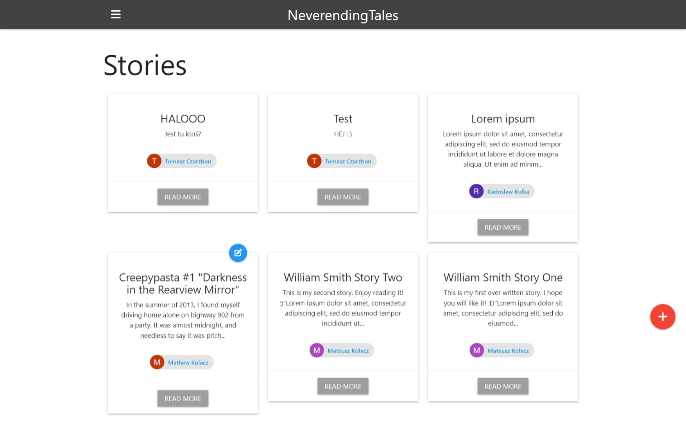

# neverending-tales

This is a project of web application which people can use to share their personal thoughts, stories or interesting events from their lives.    
The tech stack used in the project includes: Node.js, Express, MongoDB, Passport with a Google OAuth strategy and many others.

To test it on your PC you need to:
1. Clone this repo and create cluster on MongoDB.
2. Add 'config.env' file in config folder with your own `MONGO_URI` connection data, `PORT` at which the server will run, `GOOGLE_CLIENT_ID` and `GOOGLE_CLIENT_SECRET` with credentials 
   for Google OAuth 2.0 API generated at your own Google Cloud Platform account.
3. Open project in IDE (for example VS Code) and run the following commands in terminal:
    > npm install
  
    > npm run dev
4. Paste the http://localhost:3000 into your browser.
5. Use your gmail account to log in.
6. Enjoy using the app.
  
